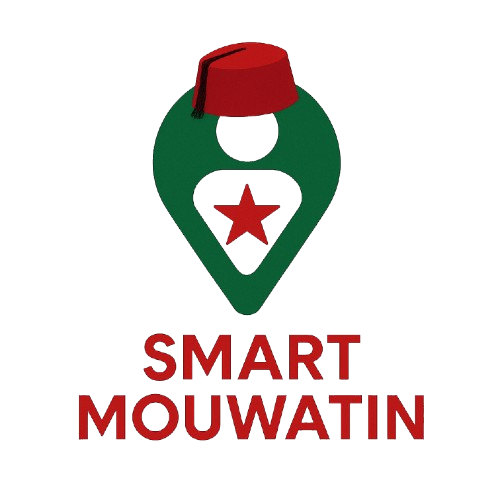

#  Smart Mouwatin

  

## Project Description

**Smart Mouwatin** is a simple and citizen-focused platform that helps **Moroccan citizens** easily access the administrative information they need.

---

###  Problem Statement

Many citizens struggle because they don’t know:
- 📄 Which **documents** are required for their specific situation.
- 📍 **Where** to go, based on their **place of residence**.

These gaps make procedures long, confusing, and frustrating.

---

###  Solution

**Smart Mouwatin** provides a clear and accessible experience:
- Lists the **required documents** for each procedure in a simple way.
- Shows **where to go** based on the user’s **current location**.
- Lets users **ask questions by voice or text**, even if they cannot read or write.
- Works on both **desktop** and **mobile**.

---
### 🎥 Demo

[▶️ Watch the demo on YouTube](https://youtu.be/MtULYWsYSgA)

---

### Key Features

- Automatic location detection  
- Intelligent assistant for administrative questions  
- Simple, inclusive, multilingual interface  
- Reliable, context-aware information based on user profile  

---

###  Technologies Used

- **Backend:** FastAPI, LangChain (RAG), ChromaDB, Sentence Transformers, Gemini API  
- **Frontend:** React.js, TailwindCSS, Vite  

---

### 🇲🇦 Vision

> _Smart Mouwatin brings citizens closer to public administration by making official information accessible to everyone — anytime, anywhere._
